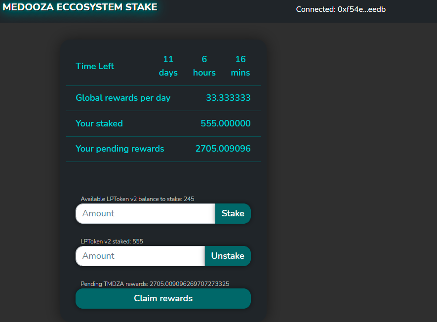
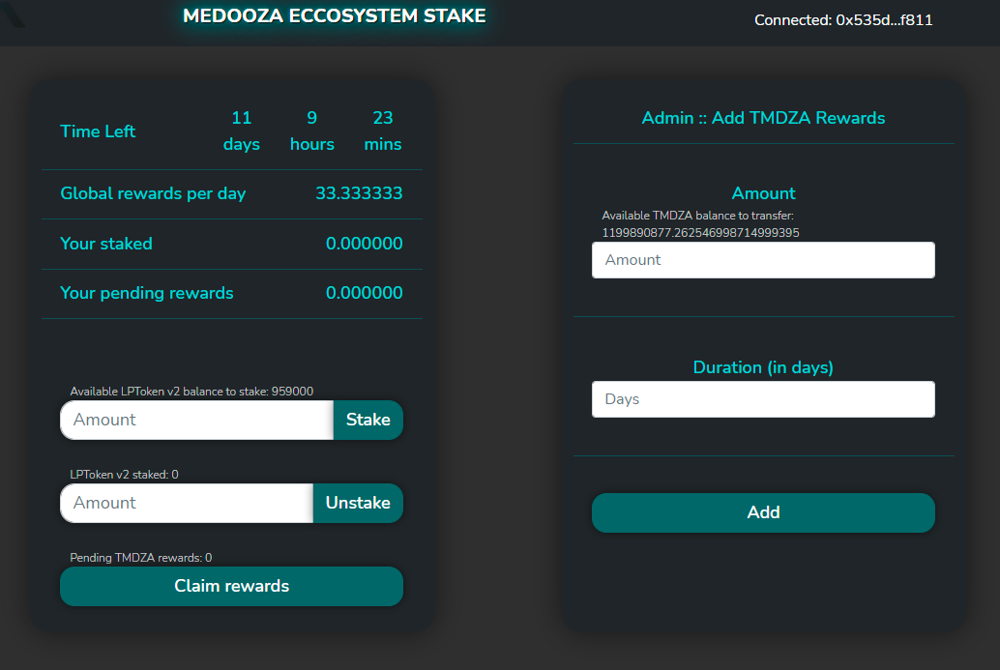

[](https://github.com/Gershon-A/eatthestake/actions/workflows/build.yaml)
[](https://github.com/Gershon-A/eatthestake/actions/workflows/push-to-dockerhub.yaml)
# Eat The Stake
Staking DApp forked from  [Eat The Blocks Projects #2](https://github.com/jklepatch/eattheblocks/tree/master/etb-projects/project2-staking).  
See it in action: [Medooza Eccosystem Stake](https://stake.medooza.network/)

Fronted:  


Admin:  

## Overview 
This application can be deployed to ANY network.
The only thing You need is to configure `depositToken` and `rewardToken` and the appropriated network.  
`rewardToken`  - is the token You reward users for the stake. You should have admin account credintials of the token.  
`depositToken` - is the token user get in exchange for pool deposit ([LP](https://www.gemini.com/cryptopedia/liquidity-provider-amm-tokens#section-how-lp-tokens-enhanced-de-fi-liquidity)) and represent user share in the poll. (see an example of Medooza (MDZA) pools on xDai).  

The flow as following:
- MDZA - is the reward token (`rewardToken`).  
- LPT  - is the liquidity token (`depositToken`).  
User add MDZA to the MDZA-xDai pull --> user get LPT that represent the user share in the poll --> user stake the LPT tokens in the dApp for `x` day --> user get reward in MDZA tokens. 

## Install
1. Install truffle/contract dependencies:
```
yarn install
```
2. Install client ([More info about client](client/README.md)  ):

```
cd client
yarn install
```

## Unit tests
```
truffle test
```

## Run
1. Pre pare for local development:
```shell
npm i ganache-cli
ganache-cli -p 8545
```
2. Deploy contracts (local):
```
truffle migrate --reset --network development
```
3. Start front end ([More info about client](client/README.md)  ): 
```
cd client
yarn start
```

4. If you'd like to pass 15 days in your Ganache blockchain, execute the following 2 lines at truffle console:
```
timestamp = (await web3.eth.getBlock(await await web3.eth.getBlockNumber()))['timestamp']
advancetime = new Promise((resolve,reject) => { web3.currentProvider.send({jsonrpc:'2.0', method: 'evm_mine', params: [timestamp+60*60*24*15], id: timestamp}, (err, result) => { if (err) { return reject(err) } return resolve(result); }) })
```
Change the time back
```
advancetime = new Promise((resolve,reject) => { web3.currentProvider.send({jsonrpc:'2.0', method: 'evm_mine', params: [timestamp+60*60*24*40], id: timestamp}, (err, result) => { if (err) { return reject(err) } return resolve(result); }) })
```

## Prepare application config files for Development, Staging & Production
Be sure You add ALL relevant environment files to `.gitignore`.  
Install dotenv: `npm i dotenv` .  
### Development
No special operation needed. Add or change the tested network in `truffle-config.js`
```
    ganache: {
      network_id: "5777",
      host: "127.0.0.1",
      port: 8545
    },  
```    
### Staging
Copy `example.env` to `.env` and add relevant parameters.
```shell
cp example.env .env
```
```
environment = "sokol"
RPC = "https://sokol.poa.network"
# Smart contract admin
ADMINACCOUNT = ""
# Smart contract admin mnemonic
MNEMONIC = ""
# Leave empty for staging.
DEPOSITTOKEN = ""
# Smart contract on sokol test net https://blockscout.com/poa/sokol/address/0x4BB2C33e0093bFCA1C3E22f9A0D97af42c8568cB
REWARDTOKEN = "0x4BB2C33e0093bFCA1C3E22f9A0D97af42c8568cB"
# The amount of LP tokens to create for testing.
LPTOKENS_AMMOUNT = "1000000"
```
Deploy:
```shell
truffle migrate --reset --network sokol
```
This will do following:  
Create dummy LP contract (`DEPOSITTOKEN`) on sokol testnet and transfer `LPTOKENS_AMMOUNT` to smart contract admin account (`ADMINACCOUNT`).
### Production
Copy `example.env` to `.env` and add relevant parameters.
```shell
cp example.env .env
```
```
environment = "xdai"
RPC = "https://rpc.xdaichain.com/"
# Smart contract admin
ADMINACCOUNT = ""
# Smart contract admin mnemonic
MNEMONIC = ""
# For example: honeyswap MDZA-xDAI Pair https://info.honeyswap.org/#/pair/0xaa32bb2aded2a2c1a0213bd5aaa84332ae59344e
DEPOSITTOKEN = ""
# Smart contract on xdai network https://blockscout.com/xdai/mainnet/token/0xbAb3cbDcBCc578445480a79ed80269C50bB5B718
REWARDTOKEN = "0xaa32bb2aded2a2c1a0213bd5aaa84332ae59344e"
# Leave empty for production. The amount of LP tokens to create for testing.
LPTOKENS_AMMOUNT = "0xbAb3cbDcBCc578445480a79ed80269C50bB5B718"
```
Deploy:
```shell
truffle migrate --reset --network xdai
```
This will do following:  
Use pools smart contract as (`DEPOSITTOKEN`) and reward token will be the smart contract token  (`REWARDTOKEN`).


## Pools
1. MDZA-xDAI Pair
https://info.honeyswap.org/#/pair/0xaa32bb2aded2a2c1a0213bd5aaa84332ae59344e
2. HNY-MDZA Pair
https://info.honeyswap.org/#/pair/0x5140dcfab6933cca971c2d1edbf4175e97d5b120
3. 1INCH-MDZA Pair
https://info.honeyswap.org/#/pair/0x4d9f71f0b50927b7ba1d528de690a15ac0f37265
4. MDZA-WXDAI Pair
https://analytics-xdai.sushi.com/pairs/0xcd4f0d66262dafa6e786a132121e84aae4ffdf24

## Audit
Doc: https://mythx-cli.readthedocs.io/en/latest/  
Audit file: [Audit file](audit/ce997d5316543b369ede443c.pdf)  
Done by [MYTHX](https://mythx.io/)

## Docker
Backend:
```shell
docker build . -t medooza-stake-backend
```
Fronted:
[More info about client](client/README.md)  
```shell
cd client ; \
docker build . -t medooza-stake-client
```
## CI/CD
### build.yaml
The pipeline do following:
1. Install dependencies globally.
2. Install backend packages and deploy contract to locally running ganache.
3. Install fronted packaged and run react coverage test. 
4. Repeating the procedure on different nodejs versions.
5. On success, package created. [Package example](https://github.com/Gershon-A/eatthestake/pkgs/container/eatthestake%2Fmedooza-stake-client)  
If the pipeline was success, You can access and run created package as following:
```shell
docker run --name medooza-stake-client2-development --env NODE_ENV=development -d -p 8282:4000 ghcr.io/gershon-a/eatthestake/medooza-stake-client:main
```
### push-to-dockerhub.yaml
If You wish to push image to Your docker hub on release, add github secrets:
```
DOCKERHUB_USERNAME
DOCKERHUB_PASSWORD
```
On release: creating docker image and upload to DockerHub `https://hub.docker.com/repository/docker/gershona/eatthestake` with the release tag.
## ToDo
### Fronted
⬜️| Instead of enter amount manual add "click to max".  
⬜️| Info about previous phase and rewards.  
### Backend
⬜️| Upgradable smart contracts.  
⬜️| Array of LPT (depositToken) tokens.  
✅| Audit

## Misc
- The contract is based upon SushiSwap's MasterChef.
- In the development network, the contract deploys 2 mock ERC20 contracts and mints tokens for the first Ganache accounts, for testing. The first account will be the owner who is allowed to add rewards, and the next 2 accounts can be used for staking and testing. These contracts (ERC20Factory and MockERC20) will not be deployed to networks other than local dev networks.

## Known issues/limitations
- The DApp was designed for 18 decimal tokens, and no support for tokens with fee on transfer and other esoterica.
- For some reason, when running the unit tests, truffle takes around 1:30 minutes before it even reaches the initial compilation stage. I'm not sure if it's a local error or something with Truffle. Anyway, this does not happen when running deployment.
- In the truffle tests it is tricky to test for balances, as we are calculating based on seconds and sometimes there is 1-3 seconds of delay. [See here Gotacha#2](https://medium.com/fluidity/standing-the-time-of-test-b906fcc374a9) for explanation. To combat this, when testing time sensitive functions, I allow the actual result to be within 3 (monetary unit allocated per second) error of margin from the expected result.
