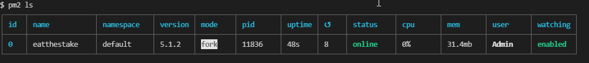

This project was bootstrapped with [Create React App](https://github.com/facebook/create-react-app).
## Important:
`client/src/contracts` properly created in [previous](../README.md) step and exists.

## CI/CD 
### build.yaml
The pipeline do following:
1. Install dependencies globally.
2. Install backend packages and deploy contract to locally running ganache.
3. Install fronted packaged and run react coverage test. 
4. Repeating the procedure on different nodejs versions.
5. On success, package created. [Package example](https://github.com/Gershon-A/eatthestake/pkgs/container/eatthestake%2Fmedooza-stake-client)  
If the pipeline was success, You can access and run created package as following:
```shell
docker run --name medooza-stake-client2-development --env NODE_ENV=development -d -p 8282:4000 ghcr.io/gershon-a/eatthestake/medooza-stake-client:main
```
### push-to-dockerhub.yaml
If You wish to push image to Your docker hub on release, add github secrets:
```
DOCKERHUB_USERNAME
DOCKERHUB_PASSWORD
```
On release: creating docker image and upload to DockerHub `https://hub.docker.com/repository/docker/gershona/eatthestake` with the release tag.
## Run with Docker
Client
```shell
cd client ; \
docker build . -t medooza-stake-client
```
Run for development:
```
docker run --name medooza-stake-client-development --env NODE_ENV=development -d -p 8181:4000 medooza-stake-client
```
The application should be available at http://localhost:8181
Run for production:
```shell
docker run --name medooza-stake-client-production --env NODE_ENV=production -d -p 8080:4000 medooza-stake-client
```
The application should be available at http://localhost:8080

## Run with PM2 process manager
Install pm2 globally and build the project `npm run build`
  ```
  npm install -g pm2 && npm run build
  ```
Start script as following:
```
pm2 start ecosystem.config.js --env production
```
Reload with different environment
```
pm2 restart/reload ecosystem.config.js [--env production]
```
Application will be listened on http://localhost:4000/

### Available Scripts
With process manager:

    `pm2 start ecosystem.config.js --env production`  
    `pm2 start ecosystem.config.js --env development`  
    `pm2 start ecosystem.config.js --env staging`  

## Run with yarn
In the project directory, you can run:

### `yarn start`

Runs the app in the development mode.<br />
Open [http://localhost:3000](http://localhost:3000) to view it in the browser.

The page will reload if you make edits.<br />
You will also see any lint errors in the console.

### `yarn test`

Launches the test runner in the interactive watch mode.<br />
See the section about [running tests](https://facebook.github.io/create-react-app/docs/running-tests) for more information.

### `yarn build`

Builds the app for production to the `build` folder.<br />
It correctly bundles React in production mode and optimizes the build for the best performance.

The build is minified and the filenames include the hashes.<br />
Your app is ready to be deployed!

See the section about [deployment](https://facebook.github.io/create-react-app/docs/deployment) for more information.

### `yarn eject`

**Note: this is a one-way operation. Once you `eject`, you can’t go back!**

If you aren’t satisfied with the build tool and configuration choices, you can `eject` at any time. This command will remove the single build dependency from your project.

Instead, it will copy all the configuration files and the transitive dependencies (Webpack, Babel, ESLint, etc) right into your project so you have full control over them. All of the commands except `eject` will still work, but they will point to the copied scripts so you can tweak them. At this point you’re on your own.

You don’t have to ever use `eject`. The curated feature set is suitable for small and middle deployments, and you shouldn’t feel obligated to use this feature. However we understand that this tool wouldn’t be useful if you couldn’t customize it when you are ready for it.

## Learn More

You can learn more in the [Create React App documentation](https://facebook.github.io/create-react-app/docs/getting-started).

To learn React, check out the [React documentation](https://reactjs.org/).

### Code Splitting

This section has moved here: https://facebook.github.io/create-react-app/docs/code-splitting

### Analyzing the Bundle Size

This section has moved here: https://facebook.github.io/create-react-app/docs/analyzing-the-bundle-size

### Making a Progressive Web App

This section has moved here: https://facebook.github.io/create-react-app/docs/making-a-progressive-web-app

### Advanced Configuration

This section has moved here: https://facebook.github.io/create-react-app/docs/advanced-configuration

### Deployment

This section has moved here: https://facebook.github.io/create-react-app/docs/deployment

### `yarn build` fails to minify

This section has moved here: https://facebook.github.io/create-react-app/docs/troubleshooting#npm-run-build-fails-to-minify
